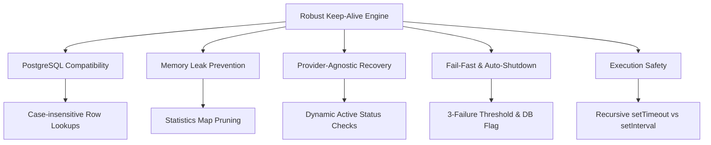

# LAB-007 Specification: Robust Session Keep-Alive Engine & PostgreSQL Compatibility

## Epic / User Story
> **As a platform operator**, I want a robust, resource-efficient, and provider-agnostic session keep-alive engine that is fully compatible with both SQLite and PostgreSQL databases, so that remote developer environments remain active without memory leaks, overlapping executions, or endless failure loops.

---

## 1. Architectural Core Goals

To ensure the highest reliability and maintainability of the Cloud Shell session orchestrator, the keep-alive engine must satisfy five architectural pillars:



---

## 2. Requirements & Detailed Technical Specifications

### Requirement 1: PostgreSQL Cross-Database Compatibility
To ensure compatibility with database engines like PostgreSQL that return field names in lowercase (e.g. `privatekey` instead of `privateKey`), all key property retrievals must be case-insensitive.
* **Impact of Failure:** If properties are fetched using case-sensitive keys (e.g., `sessionRow.privateKey`), PostgreSQL sessions will fail to locate existing keys and generate a new SSH keypair on **every single keep-alive tick**, bloating the remote Cloud Shell environment with dynamic authorized keys.
* **Technical Details:**
  * Utilize a case-insensitive helper `getRowValue(row, camelCaseProperty)` to dynamically resolve fields such as `privateKey`, `publicKey`, and `credentialRef`.
  * Ensure this dynamic lookup is active during:
    * `executeKeepAlive`
    * `executeCommand`
    * `terminateSession`
    * Credential initialization (`getCredentialRef`)
  * Actively reuse existing SSH keypairs stored in the database.

> [!IMPORTANT]
> Always verify that key generation is skipped if a `privateKey` exists in the database to prevent duplicate key propagation.

---

### Requirement 2: Memory Leak Prevention
Under heavy load or high session volume, memory allocated for in-memory tracking statistics must be fully released as soon as the corresponding sessions are terminated.
* **Technical Details:**
  * Maintain statistics in a memory registry (`keepAliveStats = new Map()`).
  * Expose a clear-up interface: `clearKeepAliveStats(sessionId)`.
  * Invoke `clearKeepAliveStats(row.id)` immediately in the session termination flow (`DELETE /api/v1/sessions/:id`) after the statistics have been compiled and sent to the client response.
  * Ensure bulk terminations (`POST /api/v1/sessions/terminate-all`) call `stopAllKeepAlives()`, which must completely wipe the stats map via `keepAliveStats.clear()`.

---

### Requirement 3: Dynamic & Provider-Agnostic Startup Recovery
When the orchestrator API restarts (due to redeployments, scale-ups, or failures), scheduled keep-alive tasks must be rehydrated dynamically and safely.
* **Technical Details:**
  * Eliminate provider-specific hardcoded checks (e.g., `provider.name === 'gcs'`) from the startup recovery loop.
  * Detect capabilities dynamically: inspect if the resolved provider exposes the function `isSessionActive(sessionRow)`.
  * Perform generic status validation: if `isSessionActive` is present, call it to verify remote active state.
  * If a session is definitively verified as inactive or deleted on the remote provider, delete the local row from the database to keep data clean.
  * Maintain recovery idempotency: guard scheduling by checking `activeKeepAliveTimers` to prevent launching duplicate timers for the same session.

---

### Requirement 4: Fail-Fast & Auto-Shutdown (Failure Threshold)
If a remote environment becomes unreachable, fails, or its credentials expire, the scheduled keep-alive task must automatically deactivate to prevent infinite log pollution and useless resource consumption.
* **Technical Details:**
  * Maintain a consecutive failure counter (`consecutiveFailures`) per session timer instance.
  * Reset the counter to `0` immediately upon any successful keep-alive run.
  * Enforce a maximum failure threshold: `MAX_CONSECUTIVE_FAILURES = 3`.
  * On the third consecutive failure:
    1. Immediately stop and deallocate the keep-alive timer from memory.
    2. Update the session `status` in the database to `FAILED` to clearly flag the environment's state to operators.
    3. Emit a structured, high-visibility error log.

---

### Requirement 5: Execution Safety via Recursive Timeout Scheduling
Scheduled keep-alive commands must never overlap or execute concurrently, even when network congestion, database locks, or slow SSH handshakes delay individual runs.
* **Technical Details:**
  * Avoid `setInterval` as it schedules executions at fixed intervals regardless of when the previous execution finished, leading to race conditions.
  * Implement **Recursive Timeout Scheduling** using `setTimeout`.
  * Ensure that the next keep-alive tick is scheduled only *after* the current asynchronous execution completely resolves (both in success and failure branches).
  * Safely clear any pending scheduled keep-alive ticks using `clearTimeout(timerId)` during session stop or deallocation.

---

### Requirement 6: Control-Plane API Keep-Alive (Hybrid Strategy)
To prevent Google Cloud Shell from automatically suspending the virtual machine every 60 minutes due to control-plane inactivity, keep-alive operations must interact directly with the Google Cloud Shell API in addition to the standard SSH daemon.
* **Impact of Failure:** Standard SSH commands bypass the GCS control plane entirely, leading the Google Cloud infrastructure to classify the environment as idle and suspend the VM after 1 hour, terminating all running docker containers and background state.
* **Technical Details:**
  * In `executeKeepAlive` in `gcs-provider.js`, after verifying the GCS status is `RUNNING`, perform a lightweight, idempotent start environment ping by calling `gcsService.startCloudShellSession({ credentialsPath })`.
  * This API-level call registers as active usage at the Google Cloud control plane level, resetting the 1-hour inactivity/idle timer.
  * Ensure this ping is executed gracefully (wrapped in a try/catch block) so that any transient API failures do not disrupt the fallback SSH-based keep-alive command.

---

## 3. Verification & Compliance Matrix

| Requirement | Target File / Component | Test Assertion Strategy | Verified Status |
| :--- | :--- | :--- | :--- |
| **Req 1: PostgreSQL** | `gcs-provider.js`, `helpers.js` | Assert `getRowValue` handles lower/camel case correctly without regenerating SSH keypairs | Passed ✅ |
| **Req 2: Stats Purge** | `keep-alive-service.js`, `sessions.js` | Assert `clearKeepAliveStats` removes mapping from Map; verify DELETE route behavior | Passed ✅ |
| **Req 3: Startup Recovery** | `keep-alive-service.js`, `server.js` | Assert `recoverKeepAlivesOnStartup` rehydrates timers generically & cleans dead rows | Passed ✅ |
| **Req 4: Fail-Fast** | `keep-alive-service.js` | Assert timer is killed and DB row marked `FAILED` after exactly 3 consecutive fails | Passed ✅ |
| **Req 5: Recursive Scheduler** | `keep-alive-service.js` | Assert no overlaps occur and timers are safely cleared via `clearTimeout` | Passed ✅ |
| **Req 6: API Keep-Alive** | `gcs-provider.js` | Assert `startCloudShellSession` is called during keep-alive to reset the idle timer | Passed ✅ |

---

## 4. Test Suite Execution

All specifications are fully verified and backed by the Node.js test suite at `tests/keep-alive-robustness-LAB007.test.js` and general regression tests:

```bash
# Execute suite to verify spec compliance
npm test
```
